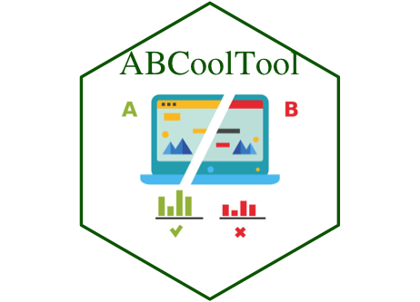

# Quick guide for using ABCoolTool

1. Install `R` software from [here](https://cran.r-project.org/). (`R studio` could be optionally downloaded as an auxiliary IDE from [here](https://rstudio.com/products/rstudio/download/))

2. Enter `R`, type in `install.packages("shiny")` and `install.packages("ggplot2")` as dependencies.

3. After finishing the installation of packages, type in `library(shiny)` to load the package into the work environment.

4. Type in `runGitHub("zeruiz/ABCoolTool")` and run. The dashboard will automatically run on the browser.
